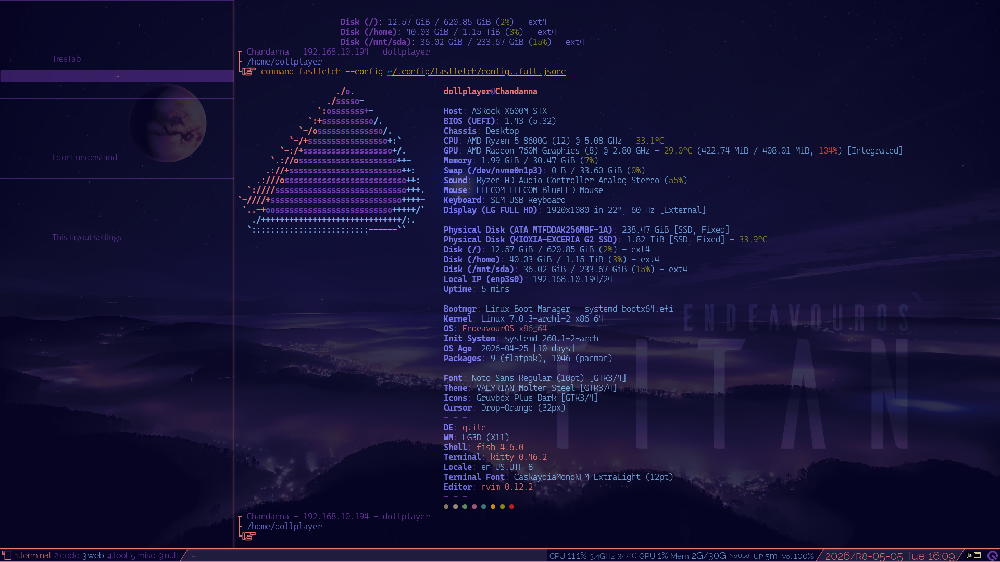

# My terminal-related dotfiles

> [!NOTE]
> Currently, it's just been "uploaded for now." (Early May 2026)

This is my terminal-related dotfiles.
I plan to create separate dotfiles for desktop environments and window managers.



- - -

## Regarding my personal approach to managing dotfiles:

- I don't use a special application for managing dotfiles.
- The actual dotfiles are all stored in this repository.
- I create a link in `~/config` for each application stored here.

For example, to add a _Kitty terminal_ configuration file to this repository, you need to execute the following from the terminal.

```fish
mv ~/.config/kitty ~/Projects/dotfiles_ver3_terminal
ln -s ~Projects/dotfiles_ver3_terminal/kitty ~/.config
```

However, I imagine that issuing these as separate commands might cause problems depending on the application.
Also, for versatility, I implemented it as a function in the Fish shell.  
See [`./fish/functions/my_mv_and_ln.fish`](./fish/functions/my_mv_and_ln.fish) for details.

**TODO:** In the future, if I perform a clean format of the OS, I will need to restore `~/.config` from this repository.
I will need to implement this Fish shell script function at a later date.

I'm not sure if this management method is the best solution for me.


## Regarding the overall color scheme:

I'm not aiming for "perfection."
I'm just hoping for a color scheme that's roughly in line with the desired look.  
The base environment is the Xfce4 environment on EndeavourOS. In other words, the background is dark blue, with orange and dark purple as accent colors.  
When it's possible to specify colors using HEX colors, I'm using the following color set.
This can be checked with `[./fish/functions/my_color_scheme.fish](./fish/functions/my_color_scheme.fish)`.

-  `#08052b`
-  `#221f45`
-  `#7f3fbf`
-  `#7f7fff`
-  `#7fbaff`
-  `#9999cc`
-  `#cc3980`
-  `#cdccdb`
-  `#e3e3ea`
-  `#ff7f7f`
